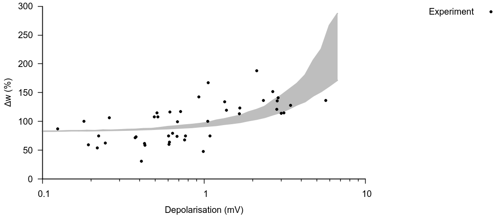

# Code for simulations with voltage-dependent STDP -> figure 2b

## How to run

On the terminal, execute the file run.sh -> $bash run.sh

Or change the file to executable -> $chmod +x run.sh

and then run it directly -> $./run.sh

It will take approximately 5 mins to run the simulation (more or less depending on your processor). 
The figure will be generated automatically once simulation is over.

## Parameters

Parameters for models are in "config.f90" file.

## Plots

## Questions

Feel free to contact me if you have any questions about the code.
